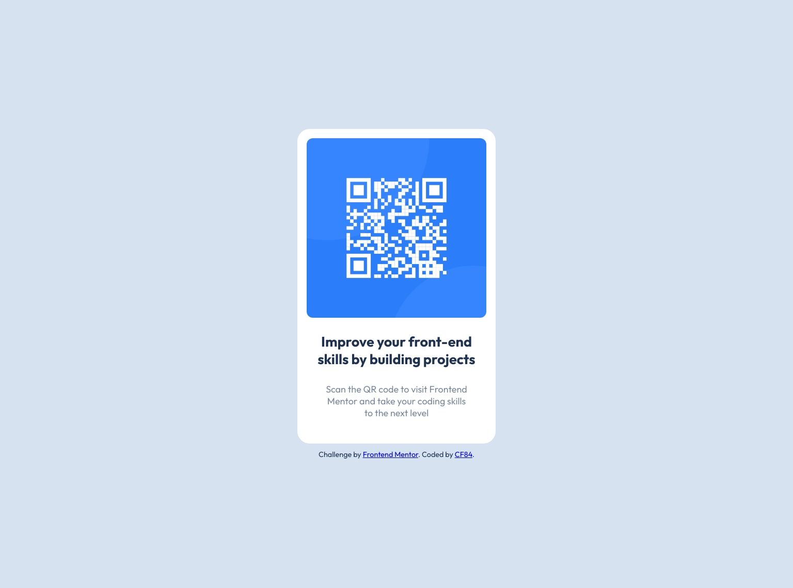

# Frontend Mentor - QR code component solution

This is a solution to the [QR code component challenge on Frontend Mentor](https://www.frontendmentor.io/challenges/qr-code-component-iux_sIO_H). Frontend Mentor challenges help you improve your coding skills by building realistic projects. 

## Table of contents

- [Overview](#overview)
  - [Screenshot](#screenshot)
  - [Links](#links)
- [My process](#my-process)
  - [Built with](#built-with)
  - [Useful resources](#useful-resources)
- [Author](#author)

## Overview

### Screenshot

### Links

## My process

### Built with

- Semantic HTML5 markup
- CSS custom properties
- Flexbox
- Google Fonts

### Useful resources

- [Responsively App](https://responsively.app) has helped me to display the website in different resolutions.

## Author

- Github - [CF84](https://github.com/CF84)
- Frontend Mentor - [@CF84](https://www.frontendmentor.io/profile/CF84)
- freeCodeCamp - [@CF84](https://www.freecodecamp.org/C84)

