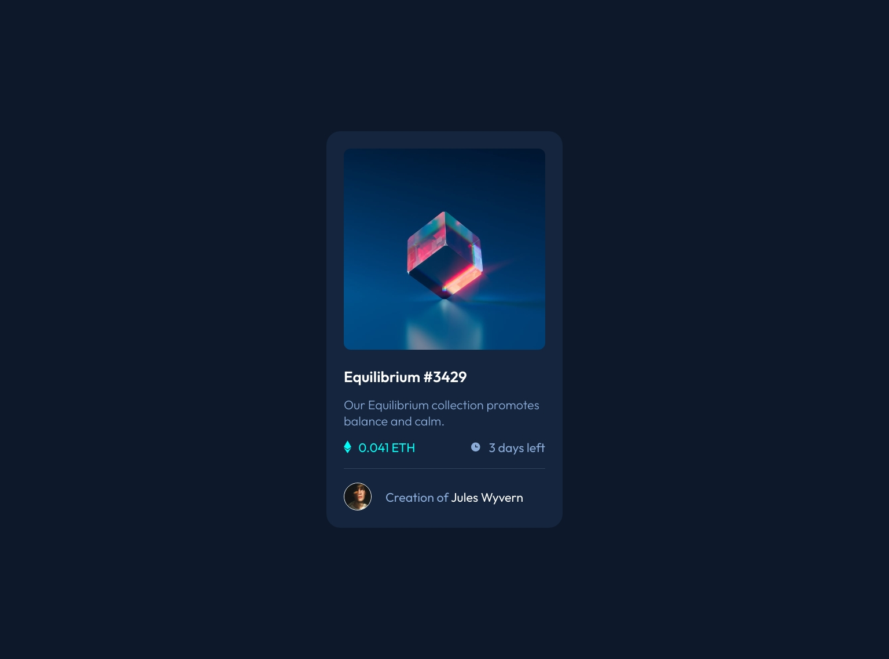

# Frontend Mentor - NFT preview card component solution

This is a solution to the [NFT preview card component challenge on Frontend Mentor](https://www.frontendmentor.io/challenges/nft-preview-card-component-SbdUL_w0U). Frontend Mentor challenges help you improve your coding skills by building realistic projects. 

## Table of contents

- [Overview](#overview)
  - [The challenge](#the-challenge)
  - [Screenshot](#screenshot)
  - [Links](#links)
- [My process](#my-process)
  - [Built with](#built-with)
  - [What I learned](#what-i-learned)
  - [Useful resources](#useful-resources)
- [Author](#author)

## Overview

### The challenge

Users should be able to:

- View the optimal layout depending on their device's screen size
- See hover states for interactive elements

### Screenshot



### Links

- Solution URL: [Frontend Mentor](https://www.frontendmentor.io/solutions/nft-preview-card-component-using-css-flexbox-wXZcWIH91c)
- Live Site URL: [GitHub Pages](https://cf84.github.io/Frontend-Mentor/02%20-%20NFT%20preview%20card%20component/)

## My process

### Built with

- Semantic HTML5 markup
- CSS custom properties
- Flexbox
- [Google Fonts](https://fonts.google.com/)

### What I learned

I have learned how to position an image over another image.
First we create a container which contains both images. The first image is inserted as img element. For the second image we take an empty span element which gets a background image via CSS.  
For the second image to be positioned correctly with "absolute", the ancestor must also be a positioned element. To achieve this, we set the position of the container that contains the images to "relative". With top, left, bottom, right set to 0 we position the second image in the middle of the container.  
Furthermore I had to set line-height of the container to 0, otherwise the container would be 5 pixels higher than the image.

```html
<div id="logo_container">
	
	<span id="logo_view"></span>
</div>
```
```css
#logo_container {
    position: relative;
    line-height: 0;
}

#logo {
    width: 100%;
    height: auto;
    border-radius: 10px;
}

#logo_view {
    position: absolute;
    top: 0;
    bottom: 0;
    left: 0;
    right: 0;
    width: 100%;
    height: auto;
    z-index: 100;
    border-radius: 10px;
}

#logo_view:hover {
    background: var(--cyan-view-bg) url(./images/icon-view.svg) no-repeat;
    background-position: center;
}
```


### Useful resources

- [How To Position CSS Overlay Image Over Image](https://codeconvey.com/css-overlay-image-over-image/)


## Author

- Github - [CF84](https://github.com/CF84)
- Frontend Mentor - [@CF84](https://www.frontendmentor.io/profile/CF84)
- freeCodeCamp - [@CF84](https://www.freecodecamp.org/C84)


