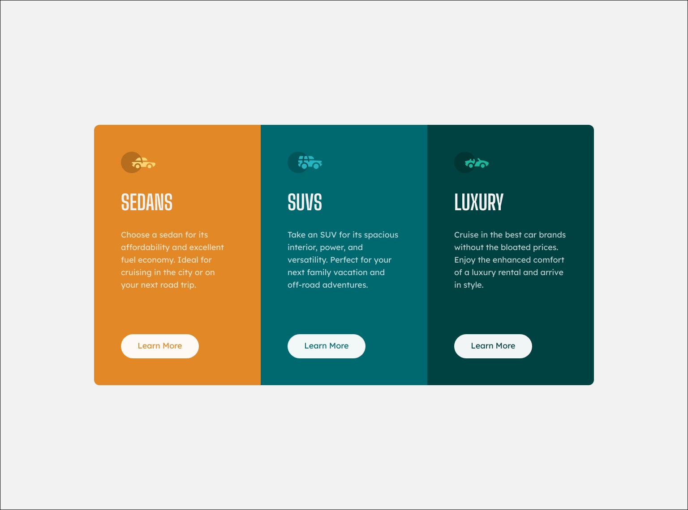
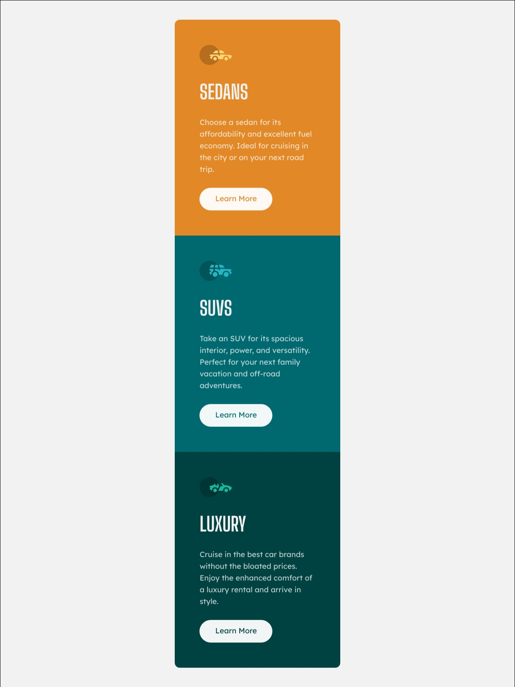

# Frontend Mentor - 3-column preview card component solution

This is a solution to the [3-column preview card component challenge on Frontend Mentor](https://www.frontendmentor.io/challenges/3column-preview-card-component-pH92eAR2-). Frontend Mentor challenges help you improve your coding skills by building realistic projects. 

## Table of contents

- [Overview](#overview)
  - [The challenge](#the-challenge)
  - [Screenshot](#screenshots)
  - [Links](#links)
- [My process](#my-process)
  - [Built with](#built-with)
- [Author](#author)

## Overview

### The challenge

Users should be able to:

- View the optimal layout depending on their device's screen size
- See hover states for interactive elements

### Screenshots

### Links
- Solution URL: [Frontend Mentor](https://www.frontendmentor.io/solutions/column-preview-card-component-using-flexbox-CRBeakIdNt)
- Live Site URL: [GitHub Pages](https://cf84.github.io/Frontend-Mentor/05%20-%20Column%20preview%20card%20component/)

## My process

### Built with

- CSS custom properties
- Flexbox
- Mobile-first workflow
- [Google Fonts](https://fonts.google.com/)

## Author

- Github - [CF84](https://github.com/CF84)
- Frontend Mentor - [@CF84](https://www.frontendmentor.io/profile/CF84)
- freeCodeCamp - [@CF84](https://www.freecodecamp.org/C84)